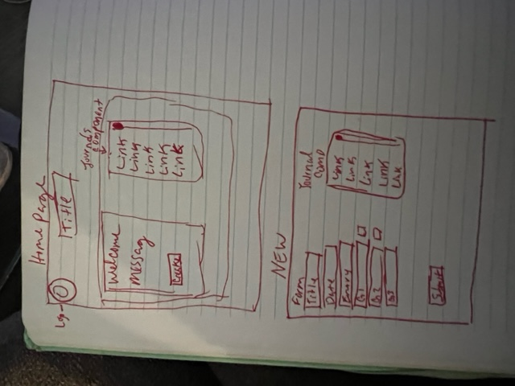
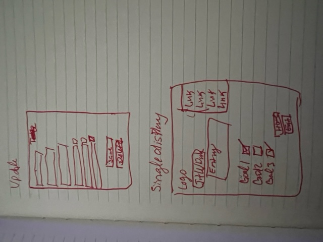
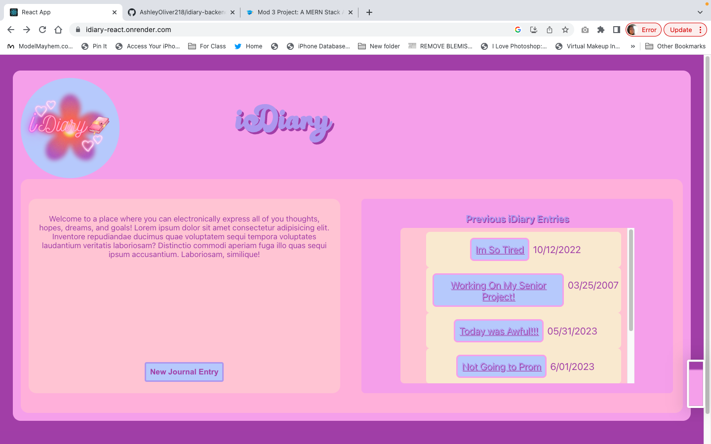
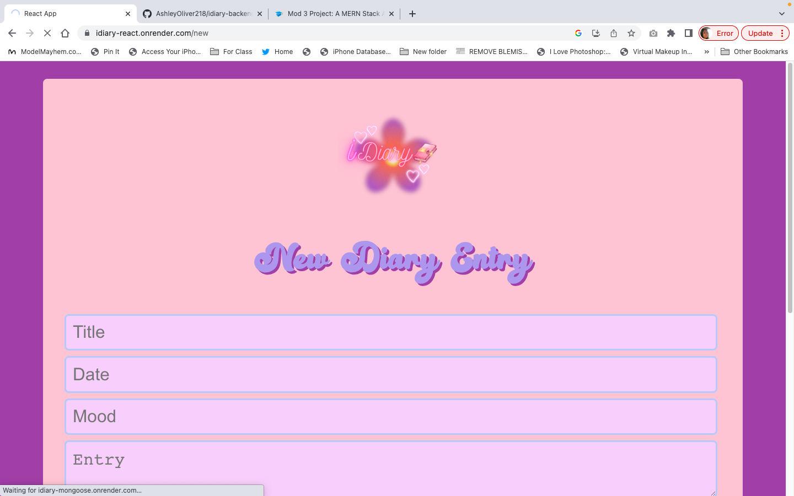
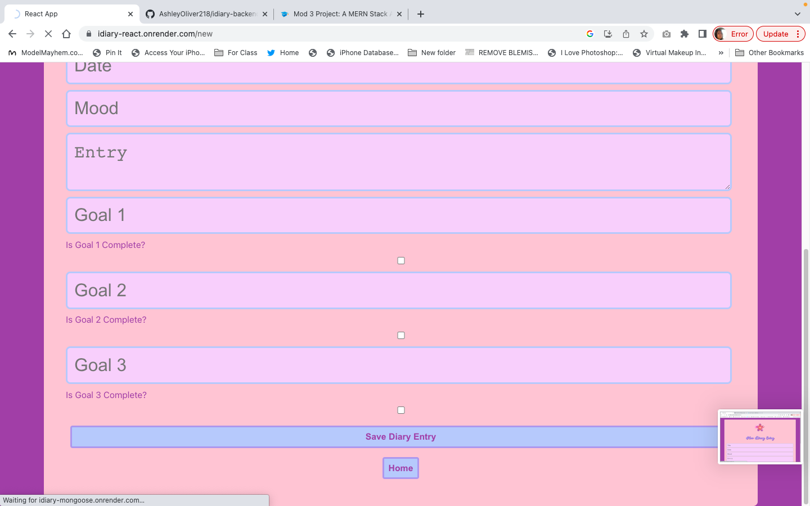
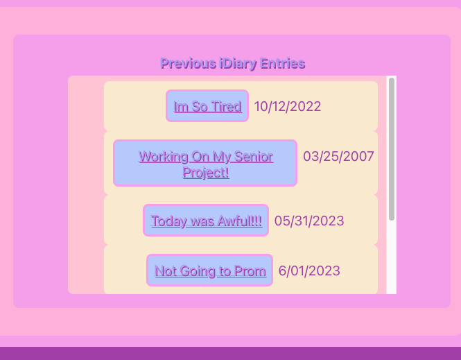
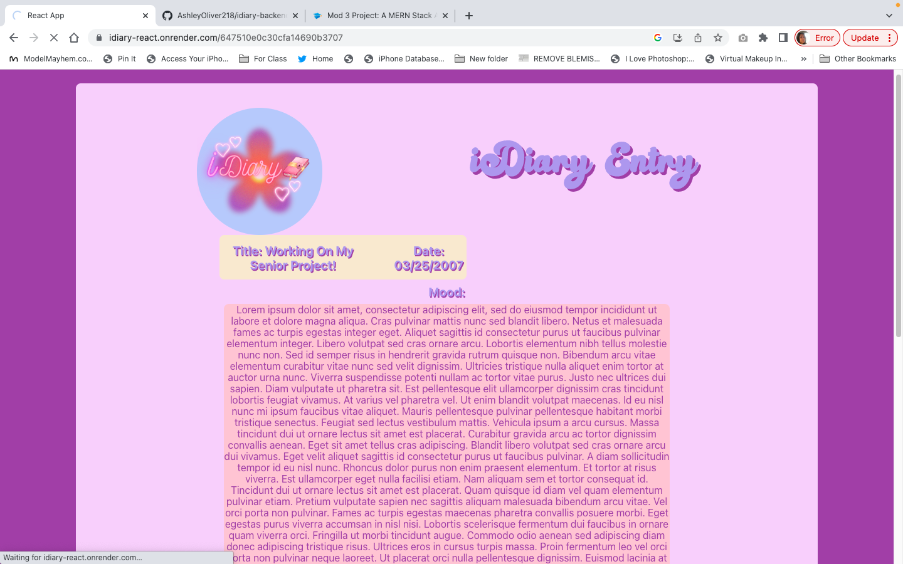
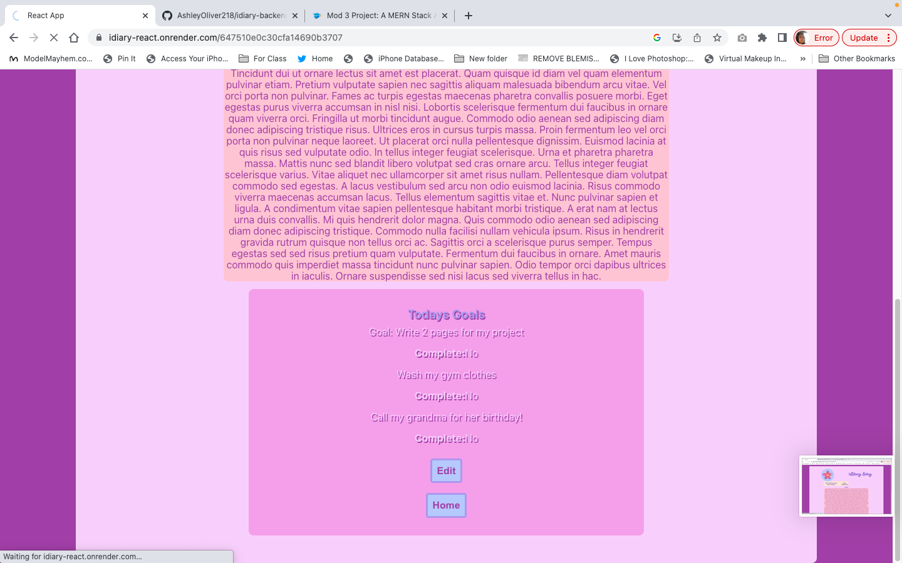
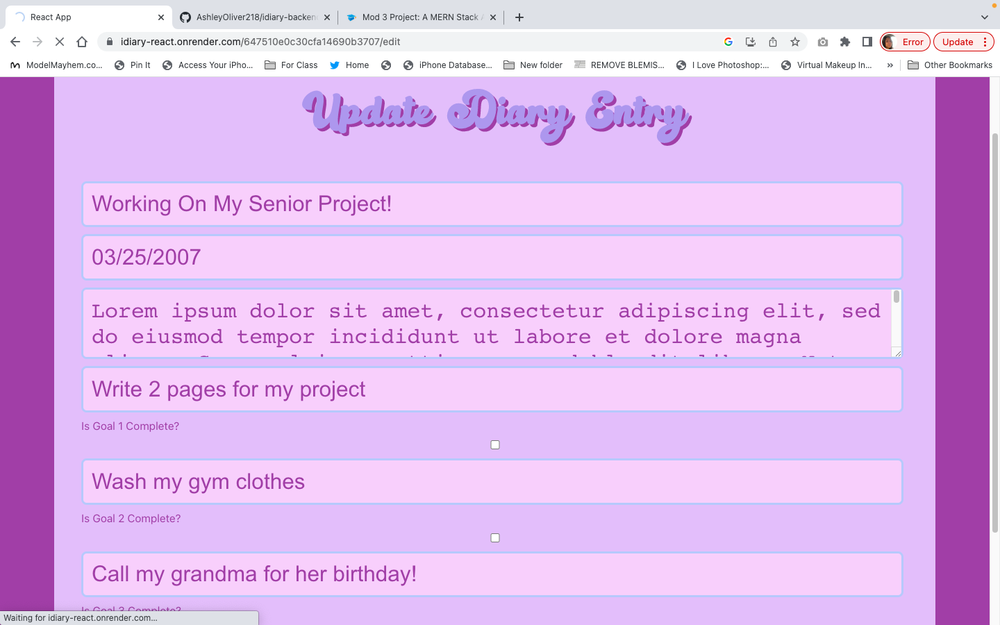
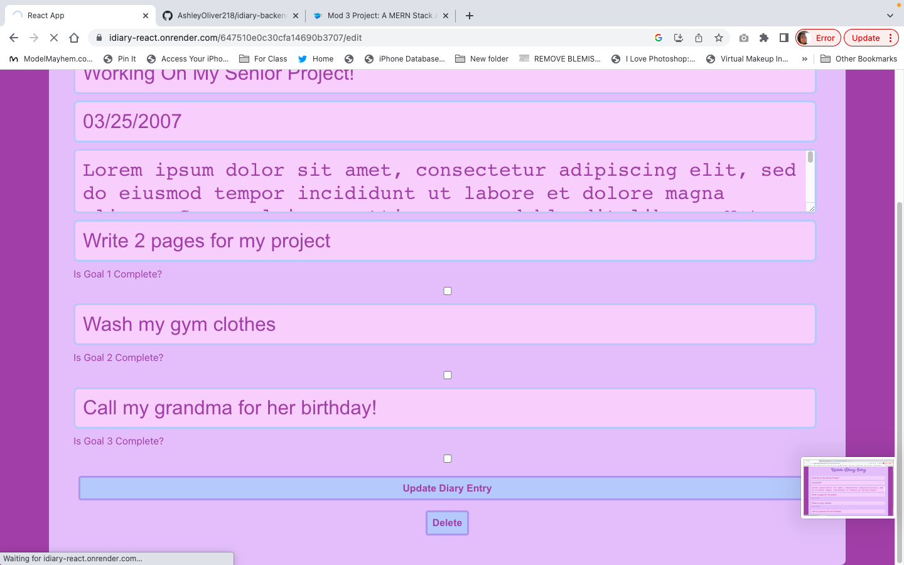

# iDiary
 I created this project to showcase my skills creating a backend API using MongoDB, and using React to create the front-end visuals. I designed it with a soft feminine color pallete. I wanted to to look very early 2000's Lizzie McGuire-esque.

# Screen Shots 

### Basic page layout ideas

### My custom logo made with a graphic created on Canva

### This page welcomes the user and gives the option create a new diary entry or view a previous one.

### This page allows you to create a new Journal entry and log your mood and give yourself 3 goals for the day which you can late mark as complete in the edit feature

### This lists the titles and dates of the entries as a link to view them. 

### Once you click on a title displayed in the Journals components, it shows the diary entry in its entirety and has a link to create an entry edit the entry on the page or go back to the home page

### This is where you can change anything about your journal entry or add to it as the day goes on. You can also mark if the goals are complete or you can delete the entry with the delete button.

# Technology Used
- Built with React
- logo created with Canva
- [my idiary api repo](https://github.com/AshleyOliver218/idiary-backend.git)

# Code Example
export async function getJournal(id) {
  const getUrl = `${baseUrl}/${id}`
  const response = await axios.get(getUrl)
  return response
}
  
This simple function is one of the most used functions in the project. You have to getJournal() before you can display it, edit it, or delete it.

# API Used
For this project I used [my idiary api repo](https://github.com/AshleyOliver218/idiary-backend.git) that I created using Mongoose, Node, and utilizing MongoDB to get all of the different information that can be displayed on the front end. Node manages the runtime environment, Monoose connects and interacts with the database, which is hosted on MongoDB.

# How to use?
Simply click [here](https://idiary-react.onrender.com/) to utilize the application.
If you wanted to use the project as a starting point for your own project you would have to create a react application in your terminal by typing: npx create-react-app *file name*
then when that is finished: npm install axios
and then git clone the files from my repository. To run a live server to see the application visually: npm start

You would also need to click [here](https://github.com/AshleyOliver218/idiary-backend.git) and follow the instructions in the repo's README to set up your backend

# Up-Coming Features
- Responsive design optimized for mobile use
- Implement user authentication and authorization
- Allow a parent limited authorization to see certain portion of the diary entries
- Parent would assign the goals to child and see if they are completed by the end of the day
- Diary entries can be searched by title

# Credits
Kasper and Dylan for all your help

 [Canva](https://www.canva.com)

